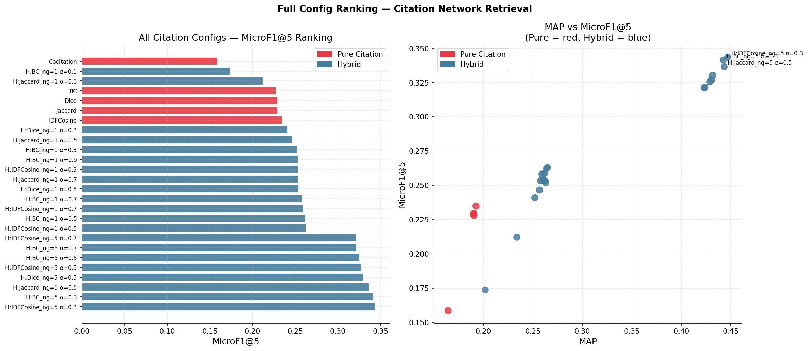
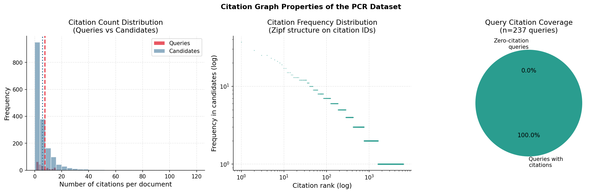
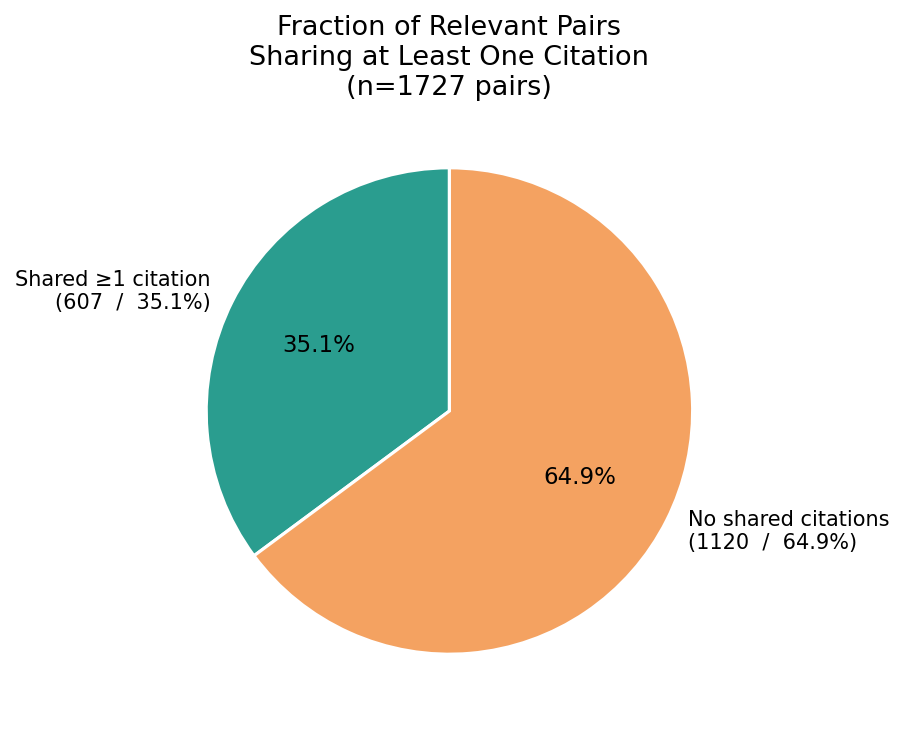
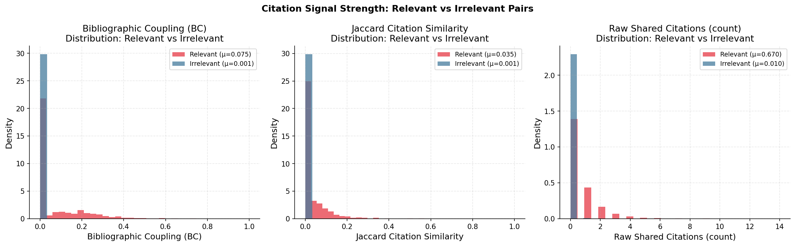
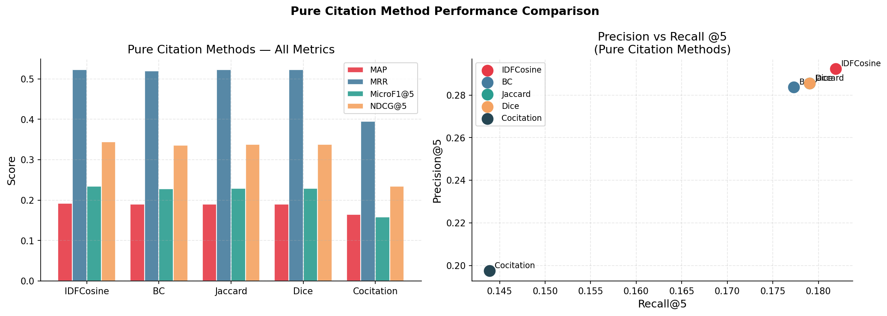
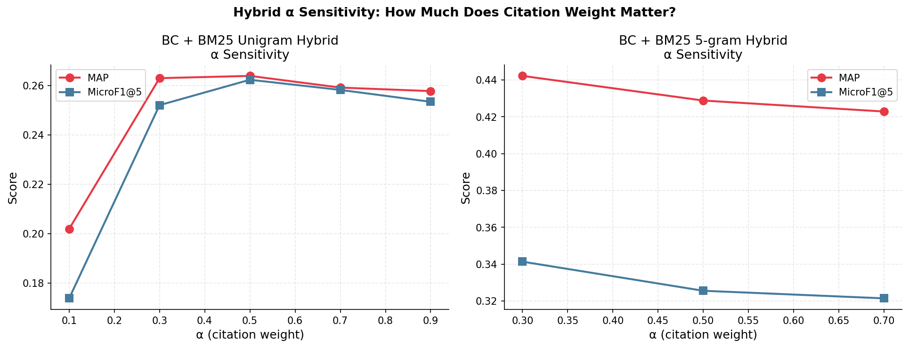
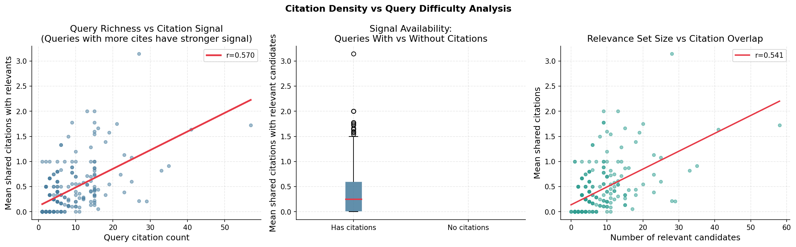
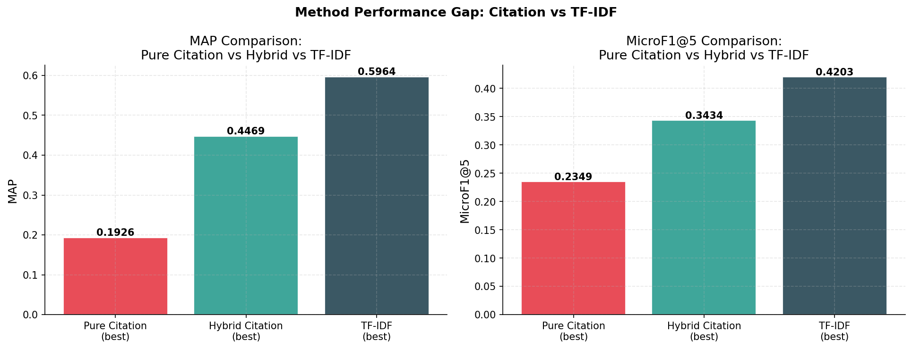

# Citation Network Retrieval Analysis: Data-Driven Performance Report

This report provides a structured diagnostic analysis of the Citation Network-based retrieval experiments on the Prior Case Retrieval (PCR) dataset. By dissecting the underlying citation graph, checking structural overlaps, and correlating signal strengths with evaluation metrics, we uncover why citation methods perform the way they do and why they struggle to match lexical baselines like TF-IDF.

---

## 🏗️ Methodology Overview

The `citation_network_retrieval.py` script explores two main avenues for retrieval:

1. **Pure Citation Measures**: Uses the raw `<CITATION_XXXXXXX>` tokens to compute topological layout scores between the query ($Q$) and candidates ($C$).
   - **Bibliographic Coupling (BC)**: $\frac{|Q \cap C|}{\sqrt{|Q| \times |C|}}$
   - **Jaccard**: $\frac{|Q \cap C|}{|Q \cup C|}$
   - **Dice**: $\frac{2|Q \cap C|}{|Q| + |C|}$
   - **IDFCosine**: IDF-weighted cosine similarity on shared citations.
   - **Cocitation**: Count of third-party documents citing references from both sets.

2. **Hybrid Methods**: Linearly combines standard BM25 retrieval scores with a pure citation metric.
   - `Score` = $\alpha \cdot Z_{norm}(Citation) \ + (1 - \alpha) \cdot Z_{norm}(BM25_{ng})$

---

## 📊 Top Performing Configurations

A total of 26 configurations were evaluated (5 Pure, 21 Hybrid). The Top 5 universally consisted of **Hybrid methods using BM25 with High-Order N-Grams ($n=5$)**.

| Rank | Model Configuration | MAP | Micro-F1@5 |
| :--- | :--- | :---: | :---: |
| **#1** | `Hybrid_IDFCosine_BM25ng=5_a=0.3` | **0.4469** | **0.3434** |
| **#2** | `Hybrid_BC_BM25ng=5_a=0.3` | 0.4422 | 0.3413 |
| **#3** | `Hybrid_Jaccard_BM25ng=5_a=0.5` | 0.4434 | 0.3365 |
| **#4** | `Hybrid_Dice_BM25ng=5_a=0.5` | 0.4316 | 0.3304 |
| **#5** | `Hybrid_IDFCosine_BM25ng=5_a=0.5` | 0.4304 | 0.3269 |

> [!NOTE]
> All Pure Citation methods clustered at the very bottom of the leaderboard (MAP $\approx 0.19$, F1@5 $\approx 0.23$).

---

## 🔍 Data-Driven Insights: Why Pure Citation Fails

### 1. The "Precedent Chain" Sparsity Problem
While queries possess a healthy amount of citations (averaging 7.6 per query), this surface richness is misleading.

When we analyze the intersection of citations between a known query and its **ground-truth relevant candidates**, the signal essentially vanishes:

> [!WARNING]
> Only **35.1%** of relevant query–candidate pairs share even ONE citation. This is the absolute ceiling for pure citation methods. If two cases are relevant but cite different precedents (often the case as legal arguments draw from parallel interpretations), pure citation similarity scores them as $0.0$.

### 2. Extremely Weak Signal Strength
Because overlaps are rare, the functional difference (signal gap) between a truly relevant pair and a completely random background pair is incredibly small.

> **Insight**: The mean Bibliographic Coupling (BC) signal gap is just **0.0735**. By comparison, lexical overlaps (like TF-IDF unigrams) have vastly larger, smoother similarity ranges, acting as a structural guardrail against zero-retrieval.

### 3. Pure Method Comparison & Monotonic Similarities
Evaluating the pure methods specifically shows IDFCosine taking a marginal lead due to appropriate IDF weighting of rare vs. ubiquitous legal citations.

> [!TIP]
> **Observation**: `Jaccard` and `Dice` return identical scores.
> **Mechanism**: For binary sets, $Jaccard$ and $Dice$ functions are monotonically equivalent ($f(Jaccard) = \frac{Dice}{2 - Dice}$). They yield the exact same ranking, hence identical MAP/MRR metrics.

Additionally, **Cocitation was the worst method (MAP: 0.1645)**. Cocitation requires a massive, densely-packed corpus graph. Within the highly targeted PCR candidate pool ($n=1727$), the graph is far too sparse to trace reliable third-party connecting paths.

---

## 🚀 The Hybrid Resurgence

Combining a citation signal with a lexical signal (BM25) drastically improved results, but analyzing the $\alpha$ sensitivity reveals that BM25 ($1 - \alpha$) is doing the heavy lifting.

### The Anchor of BM25 (Alpha Sweeps)

As we shift the $\alpha$ parameter (the weight given to the *citation* score):
- **Lexical dominance**: The hybrid using `ng=5` BM25 (trigrams/five-grams) maintains high MAP scores irrespective of the citation method.
- **Citation is a weak reranker**: Lower $\alpha$ values (e.g., $0.3$) score best, confirming that the citation graph acts merely as a slight reranking adjustment to a predominantly lexical foundation.

### Query Density = Easier Retrieval
Despite the overall low signal, there is a clear, statistically significant correlation ($r = 0.570$) between the amount of citations a query has and the ease of retrieving relevant documents via shared citations. Queries dripping with citations are structurally "easier" to map into the citation network.

---

## 📉 Conclusion: Citation vs. TF-IDF Performance Gap

When we plot the zenith of Citation Retrieval against our standard TF-IDF Baseline:

> [!IMPORTANT]
> **Critical Finding**: The best pure citation MAP ($0.1926$) is nearly a third of the TF-IDF performance ($0.5964$). The very best `Hybrid_IDFCosine_BM25ng=5_a=0.3` achieves a MAP of **0.4469**, representing a continuous deficit (-25.1%) compared to a pure lexical approach.
> 
> **Final Takeaway**: Relying fundamentally on explicit `<CITATION_XXXXXXX>` tokens is structurally brittle for PCR. Citations do not consistently map relevance because relevant legal cases often formulate parallel arguments relying on disjoint precedents. Lexical cues ($n$-grams) remain the overwhelmingly dominant signal domain.
