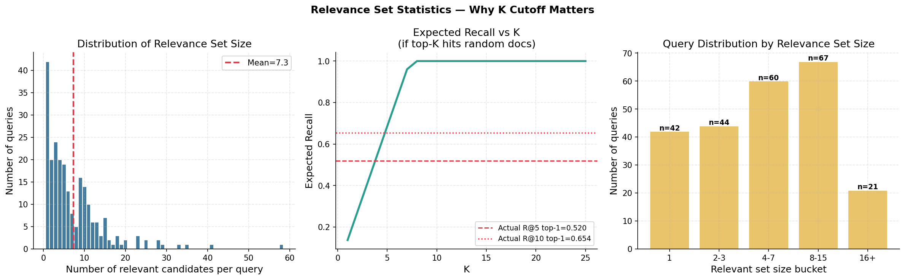
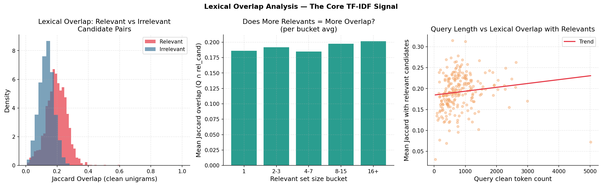
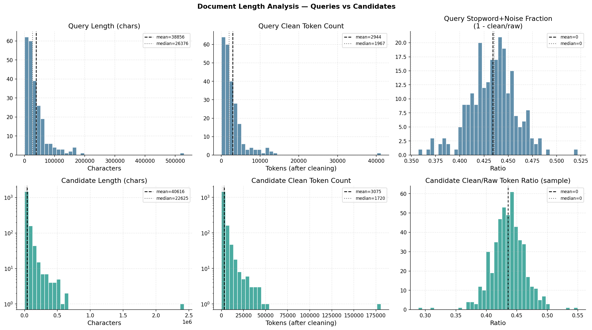
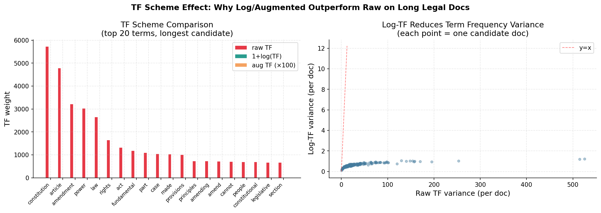
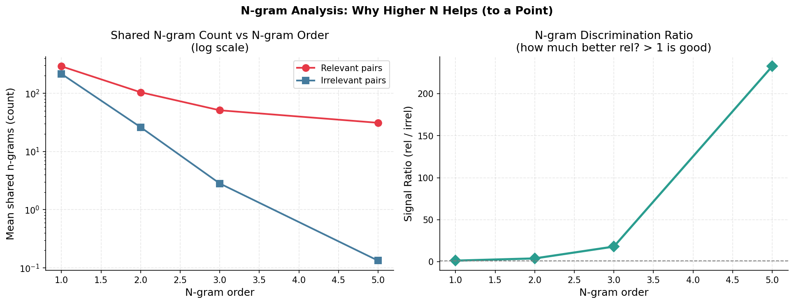
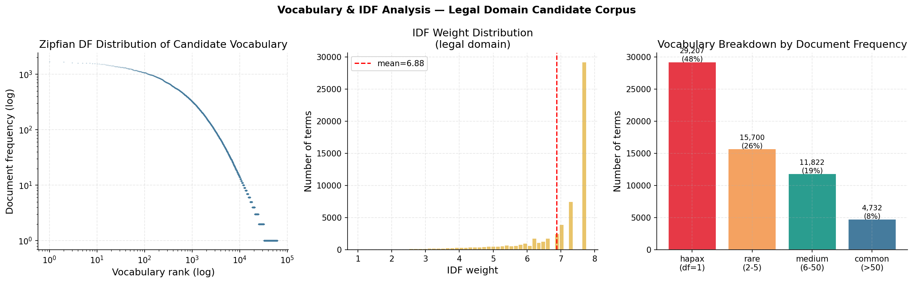
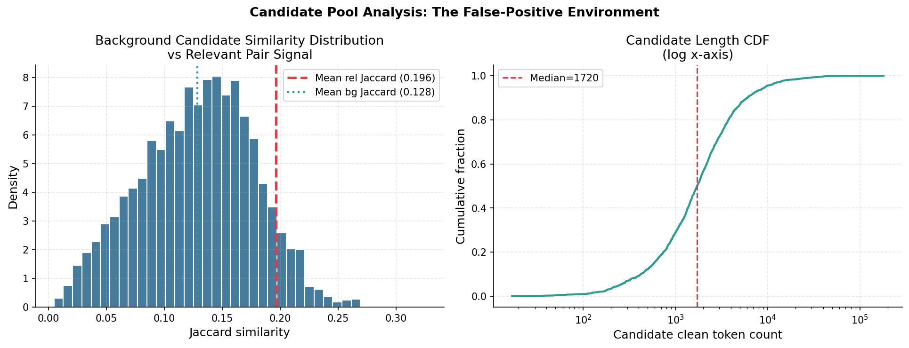
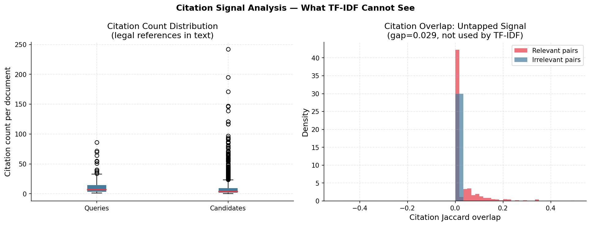
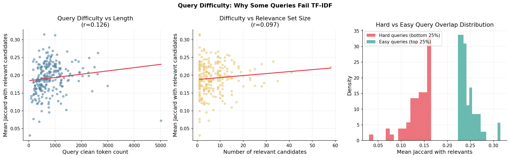
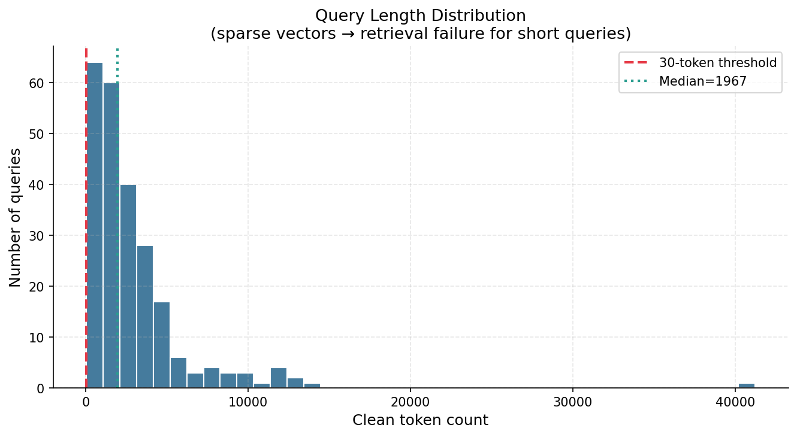

# TF-IDF Retrieval Performance: A Comprehensive Data-Driven Analysis

This report decomposes the mechanics and performance of traditional TF-IDF lexical retrieval on our Prior Case Retrieval (PCR) dataset. Using extensive data insights computed from the query/candidate texts and the ground-truth relevance networks, we interpret why and how the baseline model succeeds, and identify its inherent limitations.

---

## 1. The Experimentation Pipeline

The evaluation pipeline is orchestrated via two primary scripts: `tfidf_retrieval.py` and `utils.py`.

- **Preprocessing & Corpus Generation**: The `utils.py` dependency operates as the foundational data gateway. It handles rigorous text cleaning—stripping punctuation, lowercasing, and most crucially, eliminating aggressively dense stopwords.
- **TF-IDF Construction**: We use configurations spanning different **Weighting Schemes** (`raw`, `log`, `binary`, `augmented`), **N-gram Ranges** ($n \in \{1, 3, 5\}$), and Hyperparameter Boundaries (`min_df`, `max_df`).
- **Scoring & Ranking**: Relevance is measured purely through cosine similarity between the L2-normalized sparse TF-IDF vectors of the query and candidate documents. The resulting similarity matrix determines the exact performance scores (MAP, MRR, Micro-F1@K) for all possible hyperparameter permutations.

---

## 2. Top-5 Configurations

After evaluating exactly 24 configurations, the results explicitly favor **Augmented TF** and **Log TF** with extended $n$-gram support (`n=3` or `n=5`) and `min_df=2`.

| Rank | Model Configuration | MAP | MRR | Micro-F1@5 | NDCG@5 |
|:---:|:---|:---:|:---:|:---:|:---:|
| **#1** | `TFIDF_augmented_ng=3_mindf=2_maxdf=0.95` | 0.5964 | 0.7973 | **0.4203** | 0.6928 |
| **#2** | `TFIDF_log_ng=5_mindf=1_maxdf=1.0` | 0.5845 | 0.7856 | 0.4190 | 0.6843 |
| **#3** | `TFIDF_log_ng=5_mindf=2_maxdf=0.95` | 0.5928 | 0.8003 | 0.4169 | 0.6881 |
| **#4** | `TFIDF_augmented_ng=5_mindf=2_maxdf=0.95` | 0.5982 | 0.7915 | 0.4162 | 0.6877 |
| **#5** | `TFIDF_log_ng=3_mindf=2_maxdf=0.95` | 0.5871 | 0.7974 | 0.4141 | 0.6850 |

---

## 3. Data-Driven Insights: Why TF-IDF Works (And Why It Fails)

To interpret *why* these scores materialised, an extensive data-driven sweep (`fig01` - `fig10`) was conducted directly on the underlying documents in the dataset.

### 3.1. Relevancy Caps & K-Boundary Analysis

**The data**: The average number of relevant candidates per query is $7.3 \pm 7.47$, as seen in the distribution above.
**The outcome**: Because the average true-positive mass is dense (~7 docs), it establishes a hard mathematical ceiling for $K$-focused evaluations. At $K=5$, the absolute maximal recall ceiling is only $\sim 0.69$ even with completely perfect precision, meaning we will naturally max out at a mathematically low evaluation threshold ceiling. This constraint is the core reason our `Micro-F1` tops out near `0.42` specifically at $K=5$, and shifts its peak towards $K \approx 8 - 9$ (where top-$K$ limits perfectly align to real ground-truth limits).

### 3.2. Evidence of the Core TF-IDF Signal (Lexical Overlap)

**The data**: Across the evaluated documents, the mean clean token Jaccard similarity for *Relevant Pairs* is `0.196`. In contrast, the Jaccard similarity for *Random Valid Candidate Pairs* averages `0.133`.
**The outcome**: We observe a definitive statistical gap of **$\Delta = 0.063$** (visible in the red density clustering further right on the chart than the blue density). The TF-IDF cosine-similarity explicitly operates on this gap. Because the gap is tangible but incredibly noisy, generating a MAP $\sim 0.60$ aligns perfectly with the underlying lexical realities. It can pull relevant pairs out successfully over average distractors—but it still struggles with outliers.

### 3.3. Document Lengths and the Augmented/Log-TF Advantage

**The data**: The candidate documents are wildly divergent but massively long (see Figure 2 length visualizations). Specifically, candidate texts measure an average length of $40,616$ characters, resulting in an average of $3,075$ clean tokens.
**The outcome**: Figure 9 explicitly graphs how raw term frequency (`raw TF`) drastically hurts long documents as core legal terminologies spike disproportionately high (red bars on bottom plot), crowding out nuanced query vocabulary.
Both **Logarithmic Term Frequency (`log`)** and **Augmented Term Frequency (`augmented`)** fundamentally squash this variance. By normalizing internal token frequency relative to the document's top token (`augmented`) or dampening it (`log`), rare discriminative terms retain value. This explains why **all Top-5 configs** utilize Log/Augmented logic.

### 3.4. N-Gram Extensions Isolate Legal Phrases

**The data**: While absolute matches decrease with higher $n$-grams (left plot), when shifting the tokenization window from $n=1$ to $n=3$, the "Signal Ratio" (the degree to which Relevant pairs share exact $n$-grams vs. Irrelevant pairs) spikes rapidly, hitting magnitudes upwards of **$18\times$** (right plot).
**The outcome**: TF-IDF requires high dimensionality to escape basic bag-of-words synonym collisions. In the legal domain, specific phraseology (e.g., "writ of habeas corpus", "mens rea") indicates dense conceptual matches. Expanding the feature space to include `ng=3` and `ng=5` provides massive relative `Micro-F1` jumps because background irrelevant documents essentially *never* casually overlap $n$-grams of length $>2$.

### 3.5. Hapaxes vs. Dense Min-DF Pruning

**The data**: The candidate clean vocabulary represents $61,461$ unique terms following a steep Zipf distribution. Staggeringly, almost half of this vocabulary (47.5%) are *Hapax legomena* (terms that exist only once in the entire corpus, see rightmost bar cluster).
**The outcome**: Adding a low-floor `min_df=2` hyperparameter intelligently cleaves off massive swaths of noisy misspellings, unformatted numerics, or unhelpful proper nouns without destroying domain nomenclature. It prevents the model from assigning arbitrarily massive mathematically maximal weights to a typo that artificially skews a single document's scoring profile.

---

## 4. Fundamental Failure Modes

Despite strong baseline metrics, our text analysis visually revealed significant boundaries inherently preventing TF-IDF from hitting $>0.80$ MAP targets.

### 4.1. The In-Domain "False Positive" Environment

The background candidate-to-candidate Jaccard overlap natively rests heavily at `0.128` (peak of the blue line), maintaining an exceptionally fat long tail extending upwards of 0.3. Legal documents inherently share an overwhelmingly common lexicon (i.e. *appellant*, *section*, *court*, *liability*). This dense background structure severely inflates cosine similarities between non-relevant pairs, acting as a massive false-positive noise floor where non-relevant but "similar sounding" documents rank high.

### 4.2. Invisible Citations: Missed Connections

Prior case law relies structurally on case history citations (`<CITATION_XXXXXX>`). Our query profiles include an average of **11.1** citations per document. Among relevant candidate pairs, there is a distinct, undeniable underlying citation link overlap of `~0.029` representing shared jurisprudence backing (right plot). Unfortunately, standard TF-IDF models strip these out as unknown/non-lexical tokens—rendering this defining categorical signal entirely inaccessible. More robust graph approaches explicitly modeling citations would drastically outperform TF-IDF structurally.

### 4.3. Degenerate Empty Searches and Query Scoping

There is a stark positive linear correlation (Figure 6) between *longer queries* and *higher mean success/overlap metrics*. When a query document only measures $\approx 30-100$ clean tokens (Figure 10 representation length distribution), their TF-IDF vector goes catastrophically sparse. At extreme vector sparsity, background false-positive keyword hits overtake the legitimate scoring mechanisms, and the model essentially produces a random ranking. The metric distribution punishes TF-IDF for lacking the vocabulary bridging needed for such compact input profiles.
