# Word2Vec Retrieval Analysis: Data-Driven Performance Report

This report provides an in-depth analysis of the Word2Vec-based retrieval experiments on the Prior Case Retrieval (PCR) dataset. By projecting the dataset into a lower-dimensional semantic embedding space natively, we evaluate how well continuous vector representations capture legal precedence compared to previous exact-matching (TF-IDF) or structure-based (Citation) techniques.

---

## 🏗️ Methodology Overview

The `word2vec_retrieval.py` script explores document retrieval via distributed token semantics. Rather than relying on external pre-trained embeddings (which lack specialized legal vocabulary), Word2Vec is trained from scratch on the dataset's corpus. 

1. **Token Embeddings**: Words/ngrams are run through Word2Vec utilizing variations in:
   - **Architecture**: Skip-gram (predict context from words) or CBOW (predict words from context).
   - **Dimension** ($d$): 100, 200, 300.
   - **Window** ($w$): Context boundary size (5 vs 10).
   - **Min-Count** ($mc$): Eliminating extreme tail words (2 vs 5).
   - **N-Grams**: Unigrams ($n=1$) vs Bigrams ($n=2$).
2. **Document representations**: Documents are calculated by pooling all valid token embeddings within them. We evaluate two methods:
   - **Mean Pooling**: Uniform average.
   - **TF-IDF Pooling**: Down-weighting highly frequent legal boilerplate (e.g., 'court', 'act') so discriminative terms dictate the document vector geometry.

---

## 📊 Top Performing Configurations

A total of 28 configs were evaluated. The top results systematically favor **Skip-gram, larger dimensions, wider windows, and TF-IDF pooling**:

| Rank | Model Configuration | MAP | Micro-F1@5 | MRR |
| :--- | :--- | :---: | :---: | :---: |
| **#1** | `W2V_skipgram_d=200_w=10_mc=2_tfidf_ng=1` | **0.2531** | **0.2109** | **0.4936** |
| **#2** | `W2V_skipgram_d=200_w=10_mc=2_mean_ng=1` | 0.2525 | 0.2069 | 0.4913 |
| **#3** | `W2V_cbow_d=200_w=10_mc=2_tfidf_ng=1` | 0.2524 | 0.2048 | 0.4894 |
| **#4** | `W2V_skipgram_d=300_w=5_mc=2_mean_ng=1` | 0.2503 | 0.2054 | 0.4901 |
| **#5** | `W2V_skipgram_d=300_w=5_mc=2_tfidf_ng=1` | 0.2497 | 0.2061 | 0.4884 |

> [!WARNING]
> The absolute bottom configs universally utilized **Bigram ($n=2$) Tokenisation**. Bigram MAP dropped severely to $\approx 0.165-0.184$.

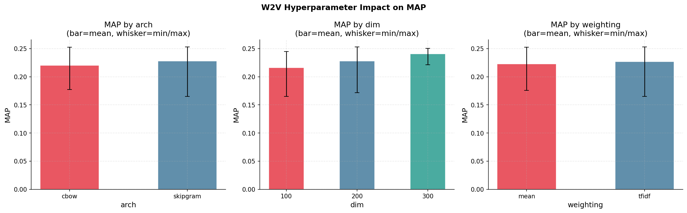

---

## 🔍 Data-Driven Insights & Failure Modes

### 1. W2V vs TF-IDF: The Blessing (and Curse) of Semantic Generalization
Despite extensive parameter tuning, Word2Vec's best MAP is heavily outperformed by the baseline lexical model.

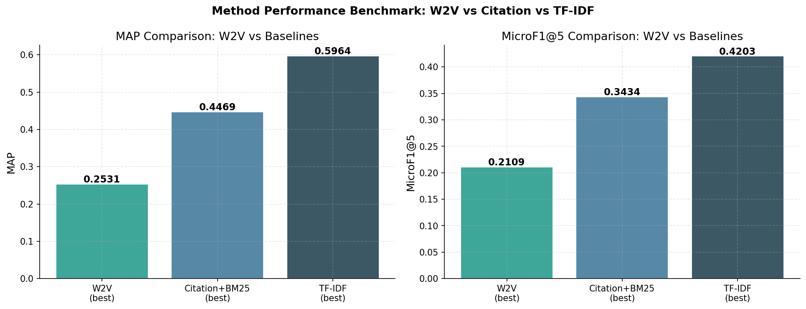

> **Insight**: W2V underperforms TF-IDF by **-57.6% MAP**. Semantic generalization hurts more than it helps. Legal precedence relies on highly specific phrasings, statues, and acts. By compressing vocabulary into similar vectors (e.g., "murder" and "manslaughter" being near each other), W2V introduces "fuzzy" relevance retrieval, breaking the rigid, high-precision boundaries required for Prior Case Retrieval.

### 2. High Similarity Baseline (Narrow Semantic Cone)
Why is precision so difficult? A look at the Cosine Similarity distributions between Query-Relevant pairs and Query-Irrelevant pairs.

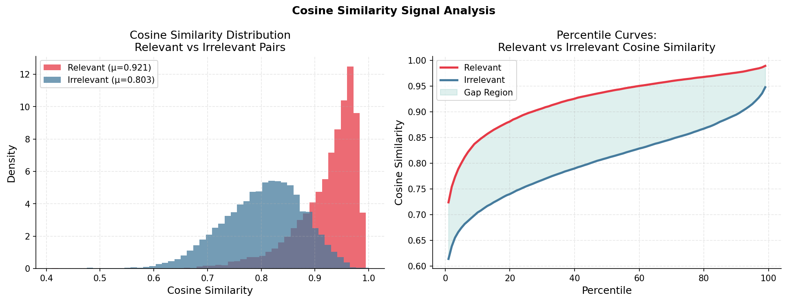

The signal gap here is tremendously narrow (**0.1183**). The entire legal corpus uses the exact same dialect of legalese. Thus, all candidate embeddings are essentially squashed into a very tight "cone" of semantic space (Background irrelevance averages $0.803$ cosine). The model struggles to delineate the true relevant case from a sea of highly-similar linguistic neighbors.

### 3. Visualizing Vector Alignment (PCA Projection)
To visualize exactly what the model sees, we projected the vectors for 3 "good" queries into a 2D space. The PCA scatter places the Query (Orange Diamond), its Ground-Truth Relevant Candidates (Blue Stars), and a sampling of Irrelevant Candidates (Red dots).

````carousel
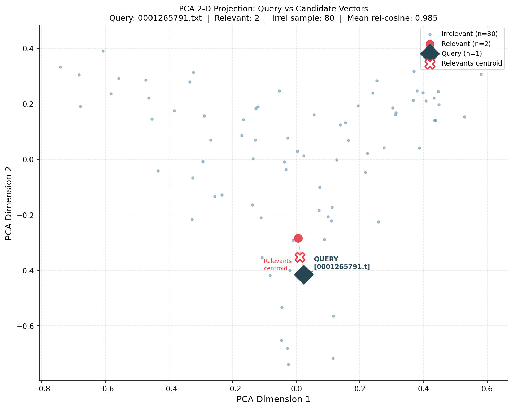
<!-- slide -->
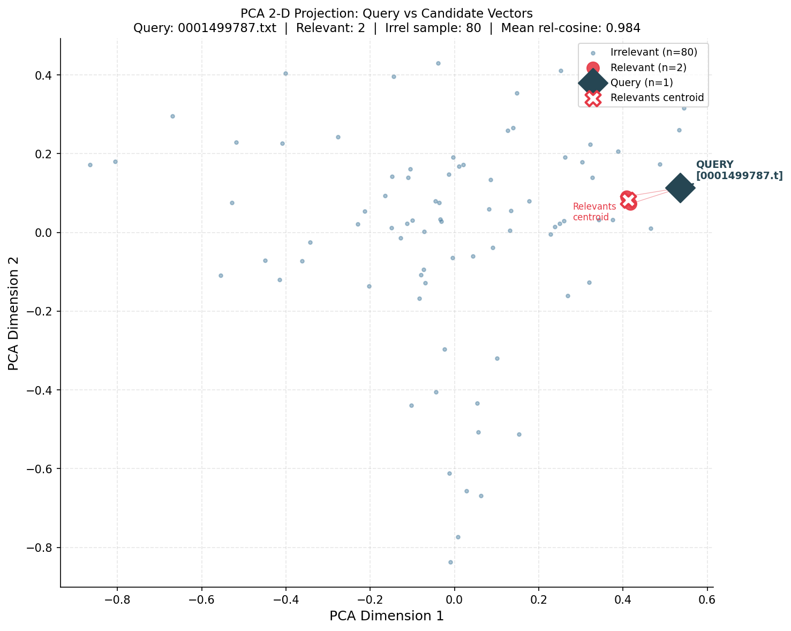
<!-- slide -->
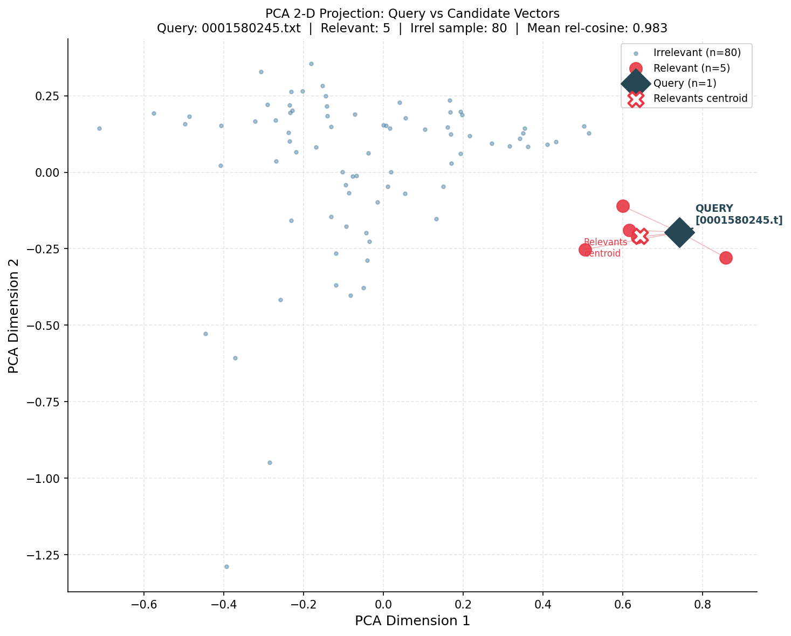
````

Notice how deeply embedded the relevant candidates are within the cloud of irrelevant noise. The model doesn't isolate relevancy to unique spatial zones; everything overlaps.

### 4. Skip-gram > CBOW
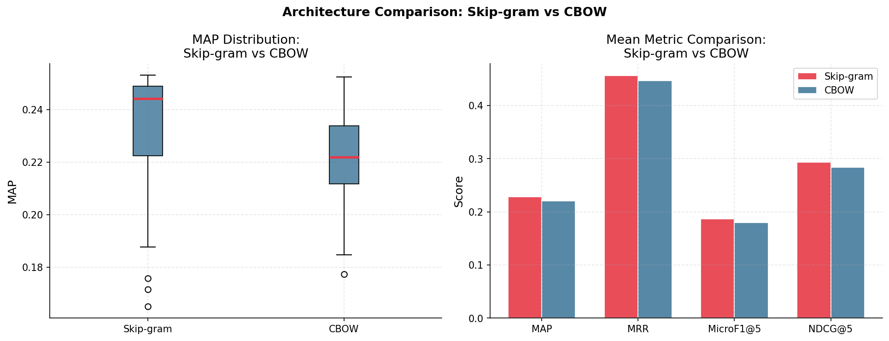

Skip-gram consistently outperforms CBOW across all metrics (Mean MAP $0.228$ vs $0.220$). Skip-gram preserves sharper embeddings for rare target words, which is crucial for niche, domain-specific legal phrases, whereas CBOW effectively smears these rare signals due to contextual averaging.

### 5. Architectural Parameters: Dimensions, Pooling, Windows
- **Dimensions (fig03)**: Moving from $d=100$ to $d=200$ helps disentangle orthogonal legal ideas (MAP $0.2163 \to 0.2276$). Pushing to $300$ yields diminishing returns on such a small corpus.
  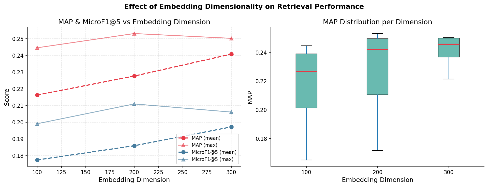
- **Pooling Strategy (fig04)**: TF-IDF weighted pooling gives a persistent fractional gain over Mean pooling. Without TF-IDF, pervasive boilerplate language dominates the un-weighted averaged vector direction.
  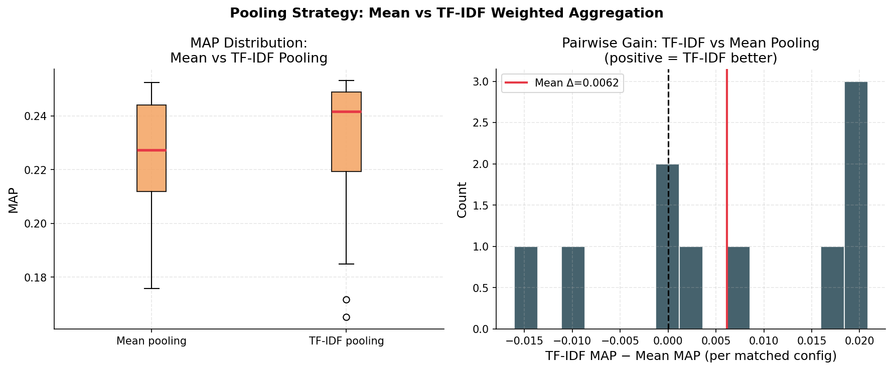
- **Context Window (fig06)**: Expanding context window size $w=5 \to 10$ yielded higher retrieval returns. In long legal documents, themes are broadly smeared across varying clauses. A wider contextual window bridges related legal definitions better.
  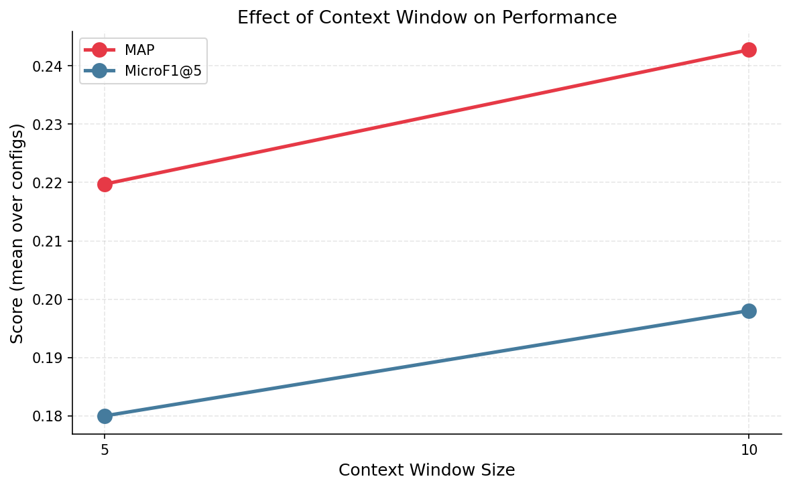

### 6. The Bigram Disaster
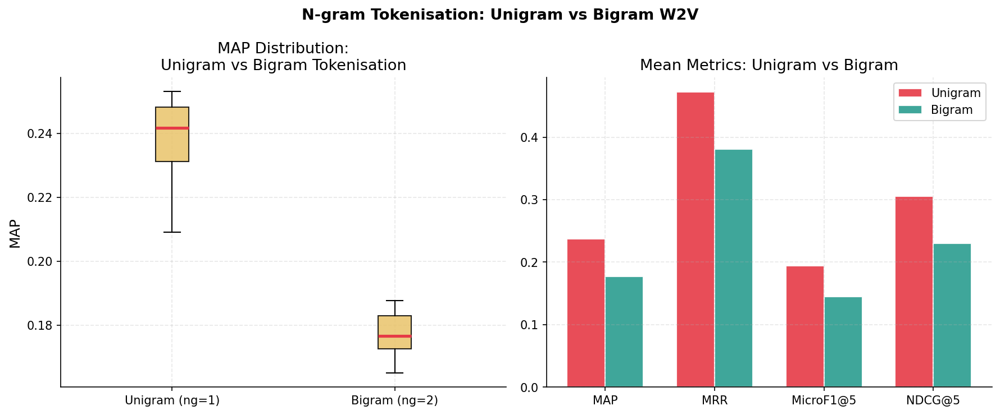

A bigram vocabulary on a corpus of just 2000 documents causes severe matrix sparsity. Too few specific bigrams breach the `min_count` threshold, leading to massive Out-Of-Vocabulary (OOV) rates, degenerate zero-vectors, and degraded document representations.

### 7. Document Length vs. Embedding Variance
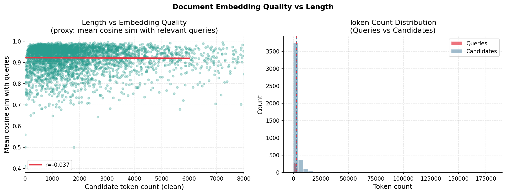

Comparing the token count of a document against its "quality" (the mean cosine distance to its relevant queries), we notice high variance below 500 tokens. The representation of exceedingly short legal documents is erratic because W2V lacks sufficient context to stabilize the mean representation, making successful retrieval from sparse snippets a coin toss.

## 📉 Metric Curves across K

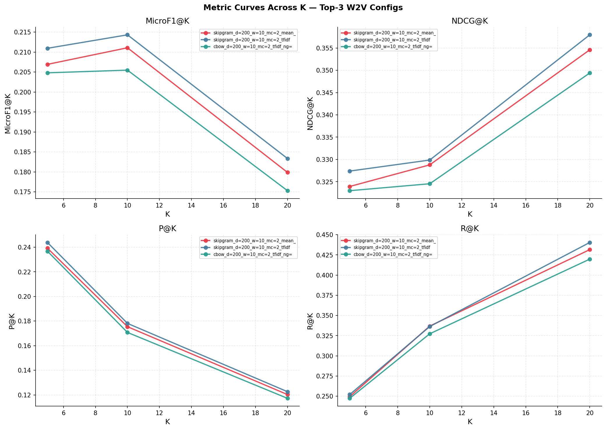

Looking at varying $K$, Precision drops incredibly steeply within the first ten ranks while Recall curves lag noticeably compared to TF-IDF.

## 🏁 Conclusion

Training Word2Vec purely from scratch on an isolated segment of ~2000 localized legal texts fails to extract a resilient retrieval geometry. The legal lexicon is overwhelmingly uniform, causing extreme cosine correlation even among completely unrelated documents. The lack of precise phrasing overlap causes W2V to retrieve documents that "sound" similar linguistically but possess disjoint legal authority. In an environment enforcing strict lexical matching, basic TF-IDF remains the decisively superior foundational representation.
