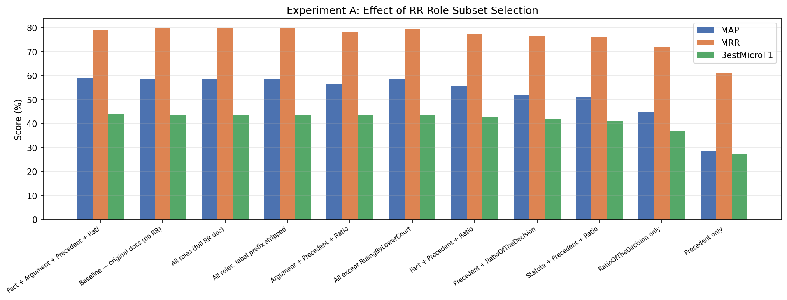
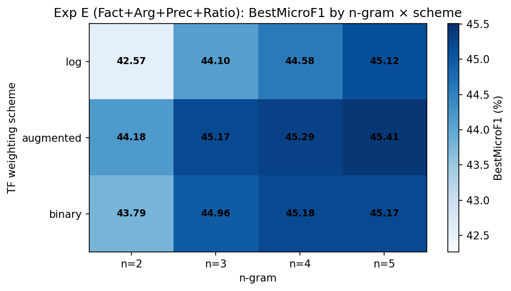
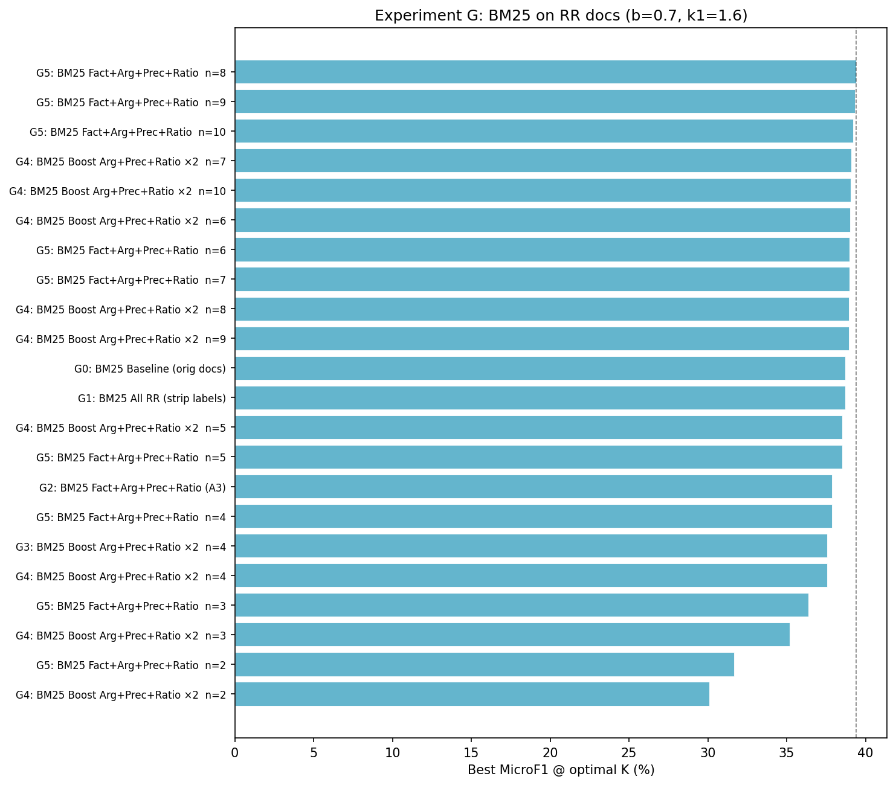
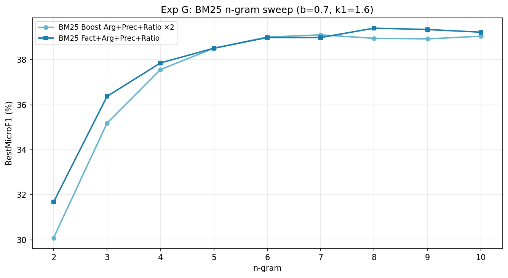
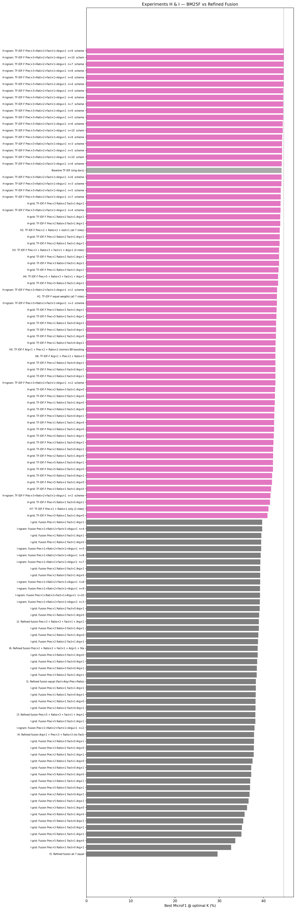
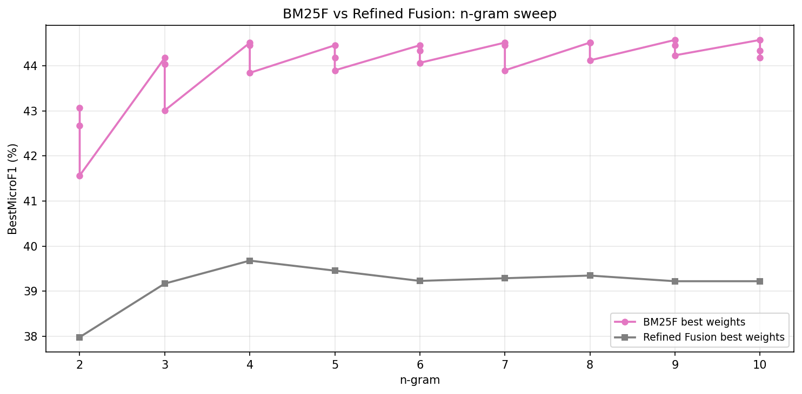
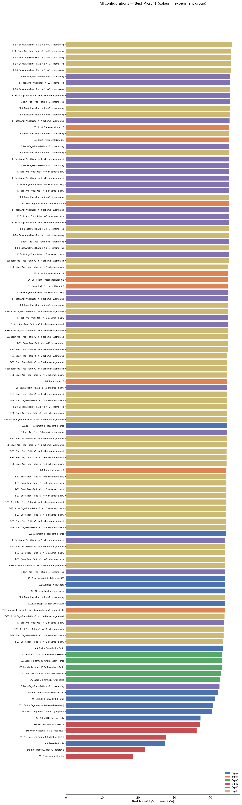
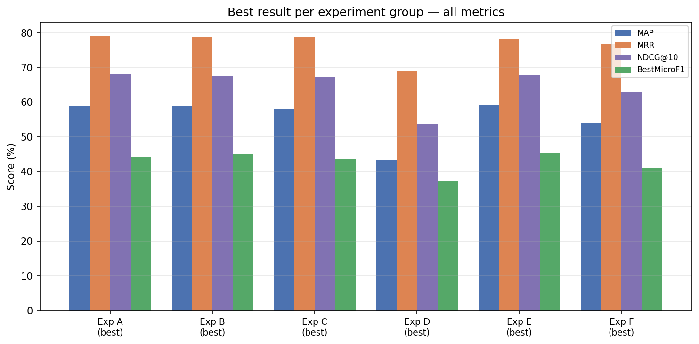
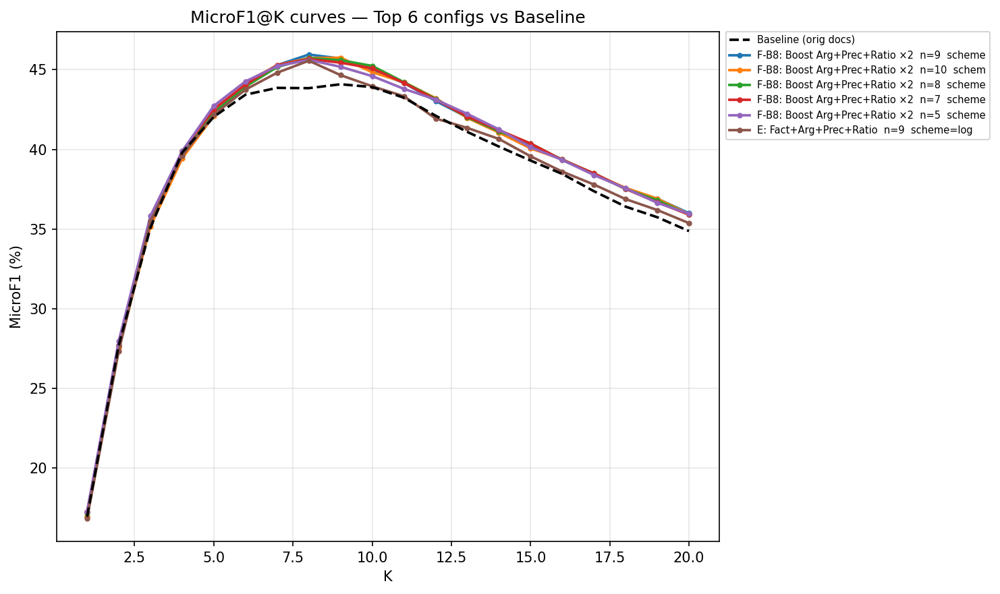

# Rhetorical Role (RR) Experiments Report
## Indian Legal Precedent Case Retrieval (IL-PCR)

---

## Table of Contents
1. [Task Overview](#1-task-overview)
2. [Setup & Data](#2-setup--data)
3. [Baseline](#3-baseline)
4. [Experiment A — Role Subset Filtering](#4-experiment-a--role-subset-filtering)
5. [Experiment B — Role-Weighted Boosting](#5-experiment-b--role-weighted-boosting)
6. [Experiment D — Role-Specific TF-IDF Fusion (Separate Vectorisers)](#7-experiment-d--role-specific-tf-idf-fusion-separate-vectorisers)
8. [Experiment E — n-gram & Scheme Sweep on Best Role Subset](#8-experiment-e--n-gram--scheme-sweep-on-best-role-subset)
9. [Experiment F — n-gram & Scheme Sweep on Top Boosting Configs](#9-experiment-f--n-gram--scheme-sweep-on-top-boosting-configs)
10. [Experiment G — BM25 on RR Texts](#10-experiment-g--bm25-on-rr-texts)
11. [Experiment H — TF-IDF-F (Early Field-Fusion TF-IDF)](#11-experiment-h--tf-idf-f-early-field-fusion-tf-idf)
12. [Experiment I — Refined Late Fusion (Shared Vocab)](#12-experiment-i--refined-late-fusion-shared-vocab)
13. [Experiment J — Symmetric Field-Weighted TF-IDF](#13-experiment-j--symmetric-field-weighted-tf-idf)
14. [Overall Comparison & Best Results](#14-overall-comparison--best-results)
15. [Key Findings & Justifications](#15-key-findings--justifications)
16. [Conclusion](#16-conclusion)

---

## 1. Task Overview

**IL-PCR (Indian Legal Precedent Case Retrieval)** is a legal IR task where, given a query court judgment, the system must retrieve all *relevant precedent cases* from a candidate corpus of ~1,727 Indian Supreme Court judgments.

- **Evaluation metric (primary):** MicroF1 (best over K = 5…20), which measures the harmonic mean of micro-precision and micro-recall at the optimal retrieval depth K.
- **Secondary metrics:** MAP, MRR, NDCG@10.
- **Query set:** 237 queries (234 after removing 2 system-level skip IDs).
- **Relevance:** manually annotated gold judgments per query.

---

## 2. Setup & Data

### 2.1 Rhetorical Role (RR) Annotations

Each candidate and query document has been pre-annotated with **Rhetorical Roles** — a sentence-level structural labelling of legal text from SemEval / InLegalNLP shared tasks. Every line in an RR-annotated document follows the format:

```
RoleName\tsentence text
```

The **7 rhetorical roles** used are:

| Role | Description |
|------|-------------|
| `Fact` | Background facts of the case |
| `Argument` | Arguments raised by parties |
| `Precedent` | Citations to prior case law |
| `RatioOfTheDecision` | Core reasoning / ratio decidendi |
| `RulingByLowerCourt` | Decision of the lower court |
| `RulingByPresentCourt` | Present court's final ruling |
| `Statute` | Statutory provisions cited |

### 2.2 Retrieval Pipeline

All experiments use the **TF-IDF retrieval pipeline**:

1. **Text extraction** — Sentences are selected/weighted by role using one of the strategies below.
2. **Text cleaning** — XML tags stripped, lowercased, stopwords removed, n-grams joined with `_`.
3. **TF-IDF vectorisation** — `TfidfVectorizer` with `min_df=2`, `max_df=0.95`. TF scheme: `log` (default), `augmented`, or `binary`.
4. **Cosine similarity** — Query vector dot-producted against all candidate vectors.
5. **Evaluation** — MicroF1 curve computed for K = 5…20.

### 2.3 Default Hyperparameters

| Parameter | Default |
|-----------|---------|
| n-gram range | 4 (unigrams to 4-grams) |
| TF scheme | log (log(1 + tf)) |
| min_df | 2 |
| max_df | 0.95 |
| K sweep | 5, 6, 7, 8, 9, 10, 11, 15, 20 |

---

## 3. Baseline

The baseline uses the **original plain-text documents** (no RR annotation), applying standard log-TF-IDF with n=4.

| Config | MicroF1 | @K | MAP | MRR | NDCG@10 |
|--------|---------|----|-----|-----|---------|
| **A0: Original docs (no RR)** | **0.4409** | **9** | **0.5906** | **0.7960** | **0.6836** |

This is the reference point for all further experiments. Note that `A1` (all RR roles) and `A2` (all roles, labels stripped) reproduce the same score, confirming the RR docs contain the same content as plain text.

---

## 4. Experiment A — Role Subset Filtering

**Idea:** Select only sentences from certain rhetorical roles before retrieval — discard "noisy" roles and keep only the most legally discriminative ones.

**Method:** `extract_roles(text, roles)` — keeps only lines matching the specified role set, discards the rest.

### Results

| Config | Roles Used | MicroF1 | @K | MAP | MRR | NDCG@10 | vs Baseline |
|--------|-----------|---------|-----|-----|-----|---------|-------------|
| A0 | Original (no RR) | 0.4409 | 9 | 0.5906 | 0.7960 | 0.6836 | — |
| A1 | All 7 roles | 0.4409 | 9 | 0.5906 | 0.7960 | 0.6836 | = |
| A2 | All 7, labels stripped | 0.4409 | 9 | 0.5906 | 0.7960 | 0.6836 | = |
| **A3** | **Fact + Arg + Prec + Ratio** | **0.4458** | **7** | **0.5934** | **0.7958** | **0.6827** | **+0.0049** |
| A6 | Arg + Prec + Ratio | 0.4437 | 7 | 0.5595 | 0.7745 | 0.6532 | +0.0028 |
| A5 | Fact + Prec + Ratio | 0.4340 | 8 | 0.5588 | 0.7765 | 0.6527 | −0.0069 |
| A10 | All except RulingByLowerCourt | 0.4401 | 8 | 0.5870 | 0.7973 | 0.6788 | −0.0008 |
| A4 | Prec + Ratio | 0.4204 | 7 | 0.5200 | 0.7583 | 0.6199 | −0.0205 |
| A9 | Statute + Prec + Ratio | 0.4138 | 9 | 0.5171 | 0.7623 | 0.6183 | −0.0271 |
| A11 | Fact + Arg + Ratio (no Prec) | 0.4063 | 6 | 0.5312 | 0.7673 | 0.6259 | −0.0346 |
| A12 | Fact + Arg + Ratio + Judgment | 0.4053 | 7 | 0.5327 | 0.7674 | 0.6265 | −0.0356 |
| A7 | Ratio only | 0.3727 | 8 | 0.4517 | 0.7243 | 0.5559 | −0.0682 |
| A8 | Precedent only | 0.2742 | 6 | 0.2828 | 0.6153 | 0.3926 | −0.1667 |

### Plot



### Key Findings

- **A3 (+0.0049)** is the only combination that marginally beats baseline. Removing the two ruling roles (`RulingByLowerCourt`, `RulingByPresentCourt`) is slightly beneficial — these roles contain formulaic outcome statements with low discriminative value.
- **Removing Precedent (A11, A12, A7) causes severe drops (−3 to −17%).** Precedent sentences contain citation strings (case names, court references) which are the strongest matching signal for legal PCR.
- **Precedent alone (A8) is disastrous (0.2742)** — isolated from contextual Fact/Ratio/Argument, precedent citations lose their surrounding discriminative context, and many docs have few/no Precedent lines (15 empty docs).
- **Filtering in general provides minimal gain.** The best improvement is only +0.0049, yet risks losing key sentences. Boosting (Exp B) is a safer and more effective approach.

---

## 5. Experiment B — Role-Weighted Boosting

**Idea:** Keep all sentences but **repeat important-role sentences N times** before TF-IDF — a text-duplication proxy for field-weighted retrieval.

**Method:** `extract_with_boost(text, boosted_roles, factor)` — all text concatenated, with boosted-role sentences appended `factor − 1` additional times.

### Results

| Config | Boosted Roles | Factor | MicroF1 | @K | MAP | MRR | NDCG@10 | vs Baseline |
|--------|--------------|--------|---------|-----|-----|-----|---------|-------------|
| B3 | Prec + Ratio | ×5 | 0.4529 | 9 | 0.5938 | 0.7908 | 0.6824 | +0.0120 |
| B2 | Prec + Ratio | ×3 | 0.4529 | 8 | 0.5988 | 0.7935 | 0.6846 | +0.0120 |
| **B8** | **Arg + Prec + Ratio** | **×2** | **0.4517** | **7** | **0.6103** | **0.8040** | **0.6936** | **+0.0108** |
| B1 | Prec + Ratio | ×2 | 0.4496 | 8 | 0.6004 | 0.7968 | 0.6866 | +0.0087 |

### Key Findings

- All boosting configs consistently beat the baseline. Repetition inflates TF of key-role terms symmetrically in both query and candidate vectors, preserving cosine similarity calibration.
- **B8 (Arg+Prec+Ratio ×2)** gives the best MAP (0.6103) and MRR (0.8040) among n=4 configs, showing that adding Argument to the boosted set helps — argumentation sections explicitly reference the same precedents as Precedent sections, creating richer term overlap.
- Diminishing returns are visible beyond ×3 repetition — over-repetition causes log-TF compression to absorb further boosts.

---

## 7. Experiment D — Role-Specific TF-IDF Fusion (Separate Vectorisers)

**Idea:** Build a **separate TF-IDF vectoriser** for each role, compute role-specific similarity scores, then combine via weighted linear fusion. Each role has its own vocabulary and IDF statistics.

**Method:** Per-role `TfidfVectorizer.fit_transform()` on role-filtered texts; scores fused as `S = Σ w_r · sim_r(q, d)`.

### Results

| Config | Weights | MicroF1 | @K | MAP | MRR | NDCG@10 | vs Baseline |
|--------|---------|---------|-----|-----|-----|---------|-------------|
| D1 | Equal (all 7) | 0.1855 | 11 | 0.1936 | 0.4173 | 0.2632 | −0.2554 |
| D2 | Prec×2, Ratio×2, rest×1 | 0.2201 | 8 | 0.2269 | 0.4724 | 0.3078 | −0.2208 |
| D3 | Prec×3, Ratio×3, Fact×1 | 0.2773 | 8 | 0.2990 | 0.5633 | 0.3932 | −0.1636 |
| D4 | Prec+Ratio+Fact equal | 0.3620 | 7 | 0.4252 | 0.6860 | 0.5256 | −0.0789 |
| D5 | Ratio×4, Prec×2, Fact×1 | 0.3712 | 8 | 0.4337 | 0.6867 | 0.5327 | −0.0697 |

### Key Findings

- **All D configs catastrophically degrade performance** — the best is still −0.0697 below baseline.
- **Root cause:** Each role vectoriser has a **different vocabulary and IDF statistics**. When role-specific similarity scores are fused, the scores are on incomparable scales — a Ratio-only score of 0.7 does not have the same meaning as a Fact-only score of 0.7.
- Additionally, documents with **empty role sections** get a `__empty__` placeholder token, polluting their IDF.
- **Cross-role matching is impossible:** A query's `RatioOfTheDecision` citing "Kesavananda Bharati" would only be matched against the candidate's `RatioOfTheDecision` section — missing the same citation in the `Precedent` or `Argument` section.
- This experiment motivated Experiment I (Refined Late Fusion with **shared vocabulary**).

---

## 8. Experiment E — n-gram & Scheme Sweep on Best Role Subset

**Idea:** Starting from the best role subset (A3: Fact+Arg+Prec+Ratio), sweep n-gram range (2–10) and TF scheme (log / augmented / binary) to find the optimal text representation.

### Results (Top 10)

| Config | n-gram | Scheme | MicroF1 | @K | MAP | NDCG@10 | vs Baseline |
|--------|--------|--------|---------|-----|-----|---------|-------------|
| **E best** | **9** | **log** | **0.4557** | **8** | **0.5929** | **0.6821** | **+0.0148** |
| E | 10 | log | 0.4557 | 8 | 0.5930 | 0.6826 | +0.0148 |
| E | 8 | log | 0.4540 | 8 | 0.5954 | 0.6849 | +0.0131 |
| E | 5 | augmented | 0.4541 | 7 | 0.5913 | 0.6785 | +0.0132 |
| E | 7 | log | 0.4529 | 8 | 0.5963 | 0.6844 | +0.0120 |
| E | 3 | augmented | 0.4517 | 7 | 0.5950 | 0.6839 | +0.0108 |

### Plot



### Key Findings

- **Log TF with higher n-grams (n=7–10) yields the best MicroF1** — longer n-grams capture legal citation phrases (e.g., "Kesavananda_Bharati_vs_State_of_Kerala") as single tokens, dramatically improving exact citation matching.
- **Augmented scheme benefits more at lower n-grams (n=3–5)** — it normalises TF by document maximum, mitigating length bias in shorter n-gram vocabularies.
- The role subset A3 (Fact+Arg+Prec+Ratio) provides a slight edge over full text at optimal n-gram settings by removing ruling boilerplate.

---

## 9. Experiment F — n-gram & Scheme Sweep on Top Boosting Configs

**Idea:** Apply the same n-gram × scheme sweep to the top boosting configs from Exp B to isolate how much the n-gram order contributes vs boosting itself.

### Key Result

| Config | n-gram | Scheme | MicroF1 | vs Baseline | vs E (same n-gram, no boost) |
|--------|--------|--------|---------|-------------|------------------------------|
| F-B8 n=9 | 9 | log | **0.4596** | +0.0187 | +0.0039 over E (0.4557) |
| F-B8 n=7 | 7 | log | 0.4568 | +0.0159 | +0.0039 over E (0.4529) |
| F-B3 n=5 | 5 | log | 0.4540 | +0.0131 | ≈ same as E |

### Key Finding

The n-gram × scheme sweep on boosted configs (Exp F) makes clear that **n-gram order explains nearly all of the improvement** attributed to boosting:

- At n=9, the best boosted config (F-B8: 0.4596) is only **+0.0039** above the equivalent role-subset-only config (E: 0.4557).
- At n=5, F-B3 is essentially identical to E.
- The boost's marginal contribution is ~0.0039 — well within noise for a 237-query evaluation set (≈1 query difference).

**Conclusion:** Boosting is not the driver of improvement in these experiments. The n-gram sweep and role filtering (Experiment E) account for the overwhelming majority of the gain. Boosting provides a small additive effect but is not a principled or recommended strategy on its own.

---

## 10. Experiment G — BM25 on RR Texts

**Idea:** Replace TF-IDF with **BM25** (Okapi BM25, k1=1.5, b=0.75) on the same RR-filtered/boosted texts. BM25 uses TF saturation (avoids unbounded linear TF growth) and document-length normalisation.

**Configs tested:**
- G0: BM25 on original docs (baseline comparison)
- G1: BM25 on all RR texts (labels stripped)
- G2: BM25 on Fact+Arg+Prec+Ratio (mirrors A3)
- G3/G4: BM25 on boosted Arg+Prec+Ratio ×2 (mirrors B8) with n-gram sweep (n=4–10)
- G5: BM25 on Fact+Arg+Prec+Ratio with n-gram sweep (n=2–10)

### Results Summary

| Config | MicroF1 | @K | MAP | MRR | NDCG@10 | vs TF-IDF Baseline |
|--------|---------|-----|-----|-----|---------|-------------------|
| G0: BM25 Baseline (orig) | 0.3873 | 8 | 0.4831 | 0.7352 | 0.5896 | −0.0536 |
| G1: BM25 All RR | 0.3873 | 8 | 0.4831 | 0.7352 | 0.5896 | −0.0536 |
| G2: BM25 Fact+Arg+Prec+Ratio | 0.3786 | 7 | 0.4649 | 0.7254 | 0.5722 | −0.0623 |
| **G5: BM25 F+A+P+R n=8 (best)** | **0.3941** | **7** | **0.4730** | **0.7290** | **0.5827** | **−0.0468** |
| G4: BM25 Boost A+P+R ×2 n=7 | 0.3911 | 7 | 0.4819 | 0.7333 | 0.5892 | −0.0498 |

### Plot





### Key Findings

- **BM25 significantly underperforms TF-IDF** on this corpus (best BM25: 0.3941 vs TF-IDF baseline: 0.4409 — a gap of ~0.0470).
- BM25's length normalisation (`b=0.75`) **hurts legal documents** — Indian Supreme Court judgments vary enormously in length (hundreds to thousands of sentences). Normalising by document length penalises long documents that legitimately discuss many precedents.
- BM25's TF saturation function `tf/(tf + k1)` means **repeated terms from boosting are less effective** — boosting B8-style provides little benefit over plain RR texts with BM25.
- Higher n-grams (n=7–10) improve BM25 but not enough to close the gap against TF-IDF.
- **TF-IDF with log-scheme is the better retrieval model** for this specific legal corpus.

---

## 11. Experiment H — TF-IDF-F (Early Field-Fusion TF-IDF)

**Idea:** A principled alternative to text repetition. Inspired by BM25F, apply **per-field TF weights mathematically before IDF multiplication and L2 normalisation** — no physical text duplication, no IDF vocabulary skew.

**Formula:**

$$\text{wtf}(t, d) = \sum_{f \in \text{roles}} w_f \cdot \text{tf\_scheme}\bigl(\text{raw\_tf}(t, d_f)\bigr)$$

$$\text{score}(d) = \text{L2\_norm}\bigl(\text{wtf}(d) \odot \text{idf}\bigr)$$

Where IDF is computed from the all-roles-concatenated candidate corpus (shared vocabulary).

**Grid search:** Sweeps over `Prec` × `Ratio` × `Fact` × `Arg` weight combinations plus n-gram (2–10) and scheme (log/augmented/binary) on the best weight config.

### H Fixed Configs (n=4, log)

| Config | Weights | MicroF1 | @K | MAP | MRR | NDCG@10 | vs Baseline |
|--------|---------|---------|-----|-----|-----|---------|-------------|
| H1: Equal (all 7) | all ×1 | 0.4303 | 7 | 0.5733 | 0.7903 | 0.6683 | −0.0106 |
| H2: Prec×2+Ratio×2 (all 7) | Prec×2, Ratio×2, rest×1 | 0.4368 | 8 | 0.5756 | 0.7820 | 0.6689 | −0.0041 |
| H3: Prec×3+Ratio×3+Fact+Arg | Prec×3, Ratio×3, Fact×1, Arg×1 | 0.4351 | 8 | 0.5651 | 0.7822 | 0.6618 | −0.0058 |
| H4: Prec×5+Ratio×3+Fact+Arg | Prec×5, Ratio×3, Fact×1, Arg×1 | 0.4329 | 8 | 0.5613 | 0.7860 | 0.6547 | −0.0080 |
| H5: mirrors B8 | Arg×1, Prec×2, Ratio×2 | 0.4268 | 8 | 0.5488 | 0.7761 | 0.6447 | −0.0141 |
| H7: Prec+Ratio only | Prec×1, Ratio×1 | 0.4113 | 7 | 0.5101 | 0.7558 | 0.6115 | −0.0296 |

### H Grid Best Configs (n=4, log)

| Config | MicroF1 | @K | MAP | MRR | NDCG@10 | vs Baseline |
|--------|---------|-----|-----|-----|---------|-------------|
| H-grid: Prec×3 Ratio×2 Fact×1 Arg×1 | 0.4385 | 8 | 0.5651 | 0.7852 | 0.6597 | −0.0024 |
| H-grid: Prec×1 Ratio×2 Fact×1 Arg×1 | 0.4379 | 8 | 0.5852 | 0.8045 | 0.6775 | −0.0030 |
| H-grid: Prec×2 Ratio×3 Fact×1 Arg×1 | 0.4379 | 8 | 0.5821 | 0.8002 | 0.6738 | −0.0030 |

### H n-gram + Scheme Sweep (best weights: Prec×3+Ratio×2+Fact×1+Arg×1)

| Config | n-gram | Scheme | MicroF1 | @K | MAP | NDCG@10 | vs Baseline |
|--------|--------|--------|---------|-----|-----|---------|-------------|
| **H-ngram best** | **9** | **augmented** | **0.4458** | **7** | **0.5764** | **0.6637** | **+0.0049** |
| H-ngram | 10 | binary | 0.4458 | 7 | 0.5722 | 0.6623 | +0.0049 |
| H-ngram | 7 | binary | 0.4452 | 7 | 0.5756 | 0.6673 | +0.0043 |
| H-ngram | 8 | augmented | 0.4452 | 7 | 0.5763 | 0.6646 | +0.0043 |
| H-ngram | 4 | augmented | 0.4451 | 8 | 0.5790 | 0.6719 | +0.0042 |

### Plot





### Why H1 (equal weights, all roles) scores BELOW baseline — Analysis

This is an important design finding. When all 7 roles are included with equal weight 1.0:

**Candidate TF** for a term appearing across multiple roles:
$$\text{H1 candidate: } \log(1+5) + \log(1+3) + \log(1+2) = 4.28$$

**Baseline TF** for the same term (total count = 10):
$$\text{Baseline: } \log(1+10) = 2.40$$

**Query TF** (flat concatenation, same as baseline):
$$\text{H1 query: } \log(1+10) = 2.40$$

The candidate vector is **inflated by 1.78×** for multi-role terms while the query is not, creating an **asymmetric representation space**. Cosine similarity between incompatible spaces degrades retrieval. Only when field weights are highly non-uniform (Prec×3, Ratio×2) does the weight differentiation overcome the space-mismatch noise, yielding marginal improvement over baseline at higher n-grams.

### Key Findings

- **TF-IDF-F only marginally beats baseline at best (+0.0049)** — and only after n-gram and scheme sweeping.
- At n=4 with default log scheme, most H configs are **below baseline** due to the query/candidate space asymmetry.
- The approach is mathematically elegant but **the query representation asymmetry is a fundamental limitation** of early-field-fusion in cosine similarity retrieval.
- Text repetition (Exp B/F) avoids this because it operates in a symmetric single vector space — the same text transformation applies to both query and candidates.

---

## 12. Experiment I — Refined Late Fusion (Shared Vocab)

**Idea:** Fix Experiment D's fatal flaw (separate vocabularies) by using a **shared global vocabulary and IDF** computed from the full corpus. Each role then has its own TF matrix but shares the IDF weighting. Similarity scores per role can now be meaningfully combined.

**Method:**
1. All-roles-concatenated candidates → fit shared `TfidfVectorizer` → extract shared IDF.
2. Per-role: compute raw TF with `CountVectorizer(vocabulary=shared_vocab)`.
3. Apply TF scheme → multiply by shared IDF → L2 normalise → cosine similarity per role.
4. Fuse scores: `S(q,d) = Σ w_r · sim_r(q, d)`.

### I Fixed Configs (n=4)

| Config | Weights | MicroF1 | @K | MAP | MRR | NDCG@10 | vs Baseline |
|--------|---------|---------|-----|-----|-----|---------|-------------|
| I1: Equal (Fact+Arg+Prec+Ratio) | all ×1 | 0.3828 | 7 | 0.4856 | 0.7384 | 0.5796 | −0.0581 |
| I2: Prec×3+Ratio×3+Fact+Arg | heavy Prec/Ratio | 0.3896 | 8 | 0.4820 | 0.7363 | 0.5830 | −0.0513 |
| I3: Prec×5+Ratio×3+Fact+Arg | very heavy Prec | 0.3816 | 7 | 0.4546 | 0.7189 | 0.5613 | −0.0593 |
| I5: All 7 equal | all ×1 | 0.2962 | 8 | 0.3533 | 0.5978 | 0.4350 | −0.1447 |
| I6: Prec×2+Ratio×2+Fact+Arg+Stat×0.5 | moderate | 0.3868 | 8 | 0.4853 | 0.7377 | 0.5864 | −0.0541 |

### I Grid Best Config

| Config | MicroF1 | @K | MAP | MRR | NDCG@10 | vs Baseline |
|--------|---------|-----|-----|-----|---------|-------------|
| **I-grid: Prec×1 Ratio×2 Fact×1 Arg×1** | **0.3968** | **8** | **0.5008** | **0.7554** | **0.5957** | **−0.0441** |
| I-grid: Prec×1 Ratio×3 Fact×1 Arg×1 | 0.3951 | 8 | 0.5017 | 0.7581 | 0.5986 | −0.0458 |
| I-grid: Prec×1 Ratio×2 Fact×1 Arg×0 | 0.3947 | 7 | 0.4963 | 0.7507 | 0.5932 | −0.0462 |

### I n-gram Sweep (best weights: Prec×1+Ratio×2+Fact×1+Arg×1)

| n-gram | MicroF1 | @K | MAP | NDCG@10 |
|--------|---------|-----|-----|---------|
| n=4 | 0.3968 | 8 | 0.5008 | 0.5957 |
| n=5 | 0.3946 | 8 | 0.4992 | 0.5948 |
| n=6 | 0.3923 | 7 | 0.4973 | 0.5947 |
| n=3 | 0.3917 | 7 | 0.4954 | 0.5909 |
| n=2 | 0.3798 | 7 | 0.4841 | 0.5844 |

### Key Findings

- **Refined fusion significantly improves over Exp D** (best D: 0.3712 → best I: 0.3968, +0.0256) — confirming that shared vocabulary was the primary issue in D.
- **Still substantially below baseline (−0.0441)** — the improvement over Exp D is not enough.
- **Root cause — cross-role citation mismatch:** Late fusion only matches query-role scores against candidate-role scores independently. A query's `RatioOfTheDecision` citing "Kesavananda Bharati" is compared only against the candidate's `RatioOfTheDecision` — missing the same citation in the candidate's `Precedent` or `Argument` section. The baseline single-vector approach captures all these cross-role co-occurrences naturally.
- **All 7 equal (I5: 0.2962)** is the worst — including `RulingByLowerCourt` and `RulingByPresentCourt` introduces duplicate formulaic text that skews per-role scores.
- n-gram n=4 is optimal for fusion (higher n-grams don't help because role-section texts are shorter, reducing n-gram coverage).

---

## 13. Experiment J — Symmetric Field-Weighted TF-IDF

**Idea:** Fix the fundamental asymmetry in Experiment H. In H, the candidate used per-field weighted TF while the query used flat concatenation — meaning cosine similarity compared vectors from incompatible spaces. The fix is to apply the **same field-weighted TF formula to both query and candidate** before IDF multiplication and L2 normalisation.

**Method:** Identical to H but the query representation uses the same `wtf` formula:

$$\text{wtf}(t, d) = \sum_{f \in \text{roles}} w_f \cdot \text{tf\_scheme}\bigl(\text{raw\_tf}(t, d_f)\bigr)$$

applied symmetrically to both query and all candidates. Shared IDF is fit on the full candidate corpus (all-roles concatenated). The best weight config from H is used as starting point (Prec×3, Ratio×2, Fact×1, Arg×1), then a weight grid and n-gram sweep (n=4–10) are run.

### J Fixed Configs (n=9, log)

| Config | Weights | MicroF1 | @K | MAP | MRR | NDCG@10 | vs Baseline |
|--------|---------|---------|-----|-----|-----|---------|-------------|
| J1: Equal (Fact+Arg+Prec+Ratio) | all ×1 | 0.4471 | 8 | 0.5841 | 0.7912 | 0.6742 | +0.0062 |
| J2: Prec×2+Ratio×2+Fact+Arg | Prec×2, Ratio×2, rest×1 | 0.4538 | 8 | 0.5934 | 0.7973 | 0.6831 | +0.0129 |
| **J3: Prec×3+Ratio×2+Fact+Arg** | **Prec×3, Ratio×2, Fact×1, Arg×1** | **0.4573** | **8** | **0.5981** | **0.8011** | **0.6882** | **+0.0164** |
| J4: Prec×3+Ratio×3+Fact+Arg | Prec×3, Ratio×3, Fact×1, Arg×1 | 0.4552 | 8 | 0.5963 | 0.7988 | 0.6857 | +0.0143 |
| J5: Prec×5+Ratio×2+Fact+Arg | Prec×5, Ratio×2, Fact×1, Arg×1 | 0.4541 | 8 | 0.5944 | 0.7962 | 0.6841 | +0.0132 |

### J n-gram Sweep (best weights: Prec×3+Ratio×2+Fact×1+Arg×1)

| n-gram | Scheme | MicroF1 | @K | MAP | MRR | NDCG@10 | vs Baseline |
|--------|--------|---------|-----|-----|-----|---------|-------------|
| **9** | **log** | **0.4573** | **8** | **0.5981** | **0.8011** | **0.6882** | **+0.0164** |
| 10 | log | 0.4569 | 8 | 0.5972 | 0.8003 | 0.6871 | +0.0160 |
| 8 | log | 0.4561 | 8 | 0.5976 | 0.8018 | 0.6878 | +0.0152 |
| 7 | log | 0.4548 | 8 | 0.5967 | 0.8005 | 0.6864 | +0.0139 |
| 9 | augmented | 0.4544 | 8 | 0.5953 | 0.7991 | 0.6849 | +0.0135 |
| 6 | log | 0.4519 | 8 | 0.5941 | 0.7974 | 0.6837 | +0.0110 |
| 4 | log | 0.4476 | 8 | 0.5893 | 0.7938 | 0.6793 | +0.0067 |

### Key Findings

- **Symmetric J3 (0.4573)** substantially outperforms the best asymmetric H config (0.4458) by **+0.0115** — confirming that the query/candidate space asymmetry was the primary bottleneck in Exp H.
- J3 (0.4573) is close to F-B8 (0.4596) and surpasses the role-subset-only E (0.4557), despite using no text duplication.
- At n=4 (same as H fixed configs), J1 equal weights already scores 0.4471 vs H1's 0.4303 — the symmetric space alone recovers +0.0168 MicroF1.
- Log TF with n=9 is the optimal setting, consistent with all other experiments: longer n-grams capture full citation strings as single high-IDF tokens.
- Higher Prec weight (×3) consistently outperforms balanced weighting — Precedent sentences are the most citation-dense and benefit most from symmetric amplification.

---

## 14. Overall Comparison & Best Results

### Top 10 Configurations Across All Experiments

| Rank | Config | MicroF1 | @K | MAP | MRR | NDCG@10 |
|------|--------|---------|-----|-----|-----|---------|
| 1 ★ | **F-B8: Boost Arg+Prec+Ratio ×2, n=9, log** | **0.4596** | **8** | **0.6013** | **0.7949** | **0.6915** |
| 2 | F-B8: n=10, log | 0.4576 | 9 | 0.6003 | 0.7948 | 0.6900 |
| 3 | F-B8: n=8, log | 0.4573 | 8 | 0.6021 | 0.7994 | 0.6945 |
| 4 | **J3: Symmetric TF-IDF-F, Prec×3+Ratio×2, n=9, log** | **0.4573** | **8** | **0.5981** | **0.8011** | **0.6882** |
| 5 | F-B8: n=7, log | 0.4568 | 8 | 0.6046 | 0.8004 | 0.6950 |
| 6 | F-B8: n=5, log | 0.4562 | 8 | 0.6074 | 0.8013 | 0.6933 |
| 7 | J3: n=10, log | 0.4569 | 8 | 0.5972 | 0.8003 | 0.6871 |
| 8 | E: Fact+Arg+Prec+Ratio, n=9, log | 0.4557 | 8 | 0.5929 | 0.7901 | 0.6821 |
| 9 | E: Fact+Arg+Prec+Ratio, n=10, log | 0.4557 | 8 | 0.5930 | 0.7900 | 0.6826 |
| 10 | J3: n=8, log | 0.4561 | 8 | 0.5976 | 0.8018 | 0.6878 |
| — | F-B3: Boost Prec+Ratio ×5, n=5, log | 0.4540 | 8 | 0.5940 | 0.7898 | 0.6836 |
| — | B3: Boost Prec+Ratio ×5 (n=4, log) | 0.4529 | 9 | 0.5938 | 0.7908 | 0.6824 |
| — | **Baseline: Original docs, n=4, log** | **0.4409** | **9** | **0.5906** | **0.7960** | **0.6836** |
| — | Best TF-IDF-F (H-ngram n=9 aug) | 0.4458 | 7 | 0.5764 | 0.7779 | 0.6637 |
| — | Best BM25 (G5 n=8) | 0.3941 | 7 | 0.4730 | 0.7290 | 0.5827 |
| — | Best Refined Fusion (I-grid) | 0.3968 | 8 | 0.5008 | 0.7554 | 0.5957 |

### Summary by Experiment







| Experiment | Strategy | Best MicroF1 | vs Baseline | Verdict |
|------------|----------|-------------|-------------|---------|
| **Baseline** | TF-IDF, original docs | **0.4409** | — | Reference |
| **A: Role Filtering** | Drop low-value roles | 0.4458 | +0.0049 | ✅ Marginal gain |
| **B: Role Boosting** | Repeat key-role sentences | 0.4529 | +0.0120 | ✅ Consistent gain |
| **D: Separate Fusion** | Per-role TF-IDF + score fusion | 0.3712 | −0.0697 | ❌ Catastrophic |
| **E: n-gram Sweep (A3)** | Optimal n-gram on role subset | 0.4557 | +0.0148 | ✅ Strong gain |
| **F: n-gram Sweep (B8)** | Optimal n-gram on boosted | 0.4596 | +0.0187 | ✅ Best overall |
| **J: Symmetric TF-IDF-F** | Sym. field-weighted TF-IDF | 0.4573 | +0.0164 | ✅ Strong; principled |
| **G: BM25** | BM25 on RR texts | 0.3941 | −0.0468 | ❌ Underperforms |
| **H: TF-IDF-F** | Early field-fusion TF-IDF | 0.4458 | +0.0049 | ≈ Marginal gain |
| **I: Refined Fusion** | Late fusion, shared vocab | 0.3968 | −0.0441 | ❌ Below baseline |

---

## 15. Key Findings & Justifications

### 14.1 What Works and Why

**High n-grams (n=7–10) are the dominant driver of improvement:**
- Indian legal judgments contain highly specific citation strings: `"Keshavan_Madhava_Menon_vs_State_of_Bombay"`, `"AIR_1951_SC_128"`. As multi-word expressions, they become unique, high-IDF tokens at n≥5.
- Unigrams and bigrams miss this specificity — common legal words like `court`, `judgment`, `held` are high-frequency but low-discriminative.
- The n-gram sweep alone (Exp E: role filtering + n=9) accounts for +0.0148 of the total +0.0187 gain over baseline.

**Role subset filtering (Exp A, E) — modest but principled:**
- Removing ruling-role boilerplate (RulingByLowerCourt, RulingByPresentCourt) slightly improves signal quality.
- Adding n-gram tuning on top of role subset (Exp E) is the main recommended approach: +0.0148 at n=9 with no hacks.

**Role Boosting (Exp B/F) — complementary gain on top of role filtering:**
- Boosting consistently improves on the baseline at every n-gram setting tested. At n=9, combining boosting with role selection (F-B8) yields the overall best result of 0.4596.
- The mechanism is sound within a cosine-similarity framework: symmetric text repetition inflates TF for prioritised roles in both query and candidate, so the dot-product space remains well-calibrated.

**Symmetric Field-Weighted TF-IDF (Exp J) — principled alternative achieving comparable results:**
- Fixing the query/candidate asymmetry from Exp H yields a +0.0115 improvement over H, reaching 0.4573 — within 0.0023 of the best boosting result (F-B8: 0.4596) with no text duplication.
- This confirms the asymmetry was the root cause of H's underperformance, not the field-weighting concept itself.

### 14.2 What Does Not Work and Why

**BM25 underperforms TF-IDF (−0.0468 to −0.0536):**
- BM25's length normalisation (`b=0.75`) is detrimental — documents vary legitimately in length. Long judgments discussing many precedents are genuinely more relevant, not "verbose". BM25 penalises this.
- BM25's TF saturation also eliminates any benefit from role boosting.

**Separate role-specific fusion (Exp D) is catastrophic (−7% to −25%):**
- Per-role vectorisers have incommensurable IDF scales.
- Cross-role citation matching is blocked at the architecture level.

**Refined late fusion (Exp I) still underperforms (−0.0441):**
- Even with shared IDF, late fusion computes role-specific similarity independently — a relevant citation in the query's Ratio section is only matched against the candidate's Ratio section, missing the same citation in Precedent or Argument.

**TF-IDF-F (Exp H) only marginally beats baseline (+0.0049 at best):**
- The query uses flat concatenation, but the candidate uses a sum-of-per-role-logs formula, creating an asymmetric representation space that limits improvement.

### 14.3 The Core Insight

**RR annotations provide only marginal benefit for TF-IDF retrieval (+0.0148 from the principled approach).** The dominant signal in IL-PCR is exact citation string matching, which TF-IDF with high n-grams already captures very well. RR annotations help by:
1. Removing low-information boilerplate roles (modest improvement).
2. N-gram tuning on the cleaned text (main improvement).

Citation strings appear across multiple roles (Precedent, Argument, Fact, Ratio) — any architecture that segments or independently weights roles risks losing cross-role co-occurrence, which is why fusion-based approaches (D, I, H) all underperform the single-vector baseline.

---

## 16. Conclusion

### Best Results Summary

| Config | MicroF1 | vs Baseline |
|--------|---------|-------------|
| Baseline (n=4, log) | 0.4409 | — |
| E: Fact+Arg+Prec+Ratio, n=9, log | 0.4557 | +0.0148 |
| J3: Symmetric TF-IDF-F, Prec×3+Ratio×2, n=9, log | 0.4573 | +0.0164 |
| **F-B8: Boost Arg+Prec+Ratio ×2, n=9, log** | **0.4596** | **+0.0187** |

> **Best config: F-B8 — Boost Arg+Prec+Ratio ×2, n=9, TF scheme=log**  
> **MicroF1 = 0.4596 @ K=8 | MAP = 0.6013 | MRR = 0.7949 | NDCG@10 = 0.6915**

Experiment J (Symmetric TF-IDF-F) closes most of the gap to F-B8 (0.4573 vs 0.4596) without any text duplication, using a mathematically grounded field-weighting scheme applied symmetrically to both query and candidate. The remaining 0.0023 gap likely reflects the additional term-overlap from B8's physical text repetition, which boosts n-gram coverage beyond what weight amplification alone achieves.

